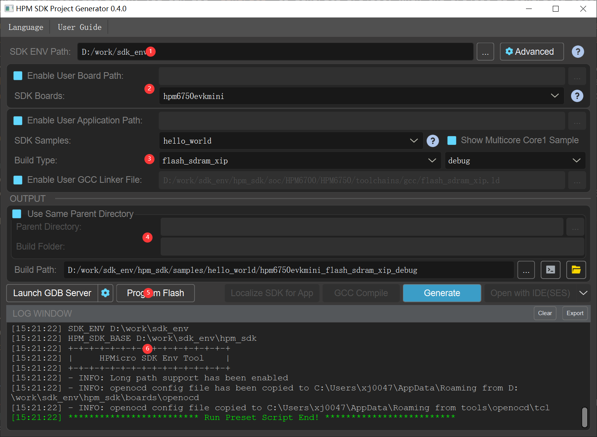

# HPM SDK Windows 开发环境配置工具

## 快速开始指南
1. 安装FT2232驱动。

1. 双击`start_cmd.cmd`，该脚本将开启一个Windows命令行窗口，之后文中将以***sdk prompt***指代该命令行窗口。（***sdk prompt***中将把所有HPM SDK开发依赖的环境变量以及对应工具的路径设置正确，作用范围仅在***sdk prompt***内，不影响当前系统中的变量。）
1. 双击`generate_all_ses_projects.cmd`，该脚本会在同级目录下生成文件夹samples_ses_project，该文件夹包含各种类型板子所有用例的segger工程

## start_gui 快速上手
`start_gui.exe` 是一款适配 `hpm_sdk` 的项目构建可视化工具。通过该工具，您可以方便地对 `hpm_sdk` 中的 samples 进行构建，也可以自定义 sample 目录来构建自己的应用程序。软件整体界面如下图所示:

上方菜单栏支持设置中英双语以及打开当前使用指南。同时为方便用户查看使用 `hpm_sdk`，工具内置了三个快速打开 `hpm_sdk` 文档入口，即上图中三个浅紫色圆形按钮。 `SDK ENV` 右侧的帮助按钮会打开当前 `hpm_sdk` 的帮助文档首页。`SDK Boards` 下拉框右侧的帮助按钮会直接打开当前选择的开发板文档。`SDK Samples` 下拉框右侧的帮助按钮会直接打开当前选择的 sample 文档。您可以根据需要选择打开对应的文档。

工具通过不同的背景色分为了以下几个功能区：

1. SDK ENV 设置：此处可手动配置 SDK ENV 路径，点击 `Advanced` 按钮后，可以对 `hpm_sdk` 以及 `CMake、Ninja` 等工具路径进行更详细的配置；

2. Board 设置：默认情况下，工具会列出 `hpm_sdk/boards` 文件夹下所有的开发板，您可以点击下拉框右侧的帮助按钮打开当前选择开发板的本地文档。同时，工具也支持加载用户自定义的开发板配置。用户需要首先勾选 `Enable User Board Path` 复选框启用 `User Board` 搜索功能，然后选择想要搜索的开发板文件夹，软件会搜索`当前文件夹`以及`第一级子文件夹`，当查找到文件夹下存在`CMakeLists.txt 以及 与文件夹同名的 yaml 配置文件`时，会识别当前文件夹为开发板配置，加入到列表项中。当`当前文件夹`被识别为开发板配置时，不会再搜索子文件夹；

    **注意：如果使用自定义 board，CMake 构建过程会尝试在自定义目录下搜索与 board 目录同名的 .cfg 文件作为板级 openocd 的配置文件，若无此文件，openocd 将不会添加任何板级配置文件**

3. Sample 设置：选择了开发板后，工具会根据开发板的yaml配置文件自动筛选符合条件的 sample。默认情况下，会展示`hpm_sdk/samples` 文件夹下经过筛选的 sample，您可以点击下拉框右侧的帮助按钮打开当前选择 sample 的本地文档。对于双核程序，该 sample 列表默认隐藏 core1 项目，用户如果想要展示 core1 项目，只需要点击右侧复选按钮进行设置即可。同时，工具也支持加载用户自定义的 sample 文件夹。用户需要首先勾选 `Enable User Application Path` 复选框启用 `User Applications` 搜索功能，然后选择想要搜索的 sample 文件夹，软件会搜索`当前文件夹`以及`所有子文件夹`，当查找到文件夹下存在 `CMakeLists.txt`时，会查找当前`CMakeLists.txt`是否调用了 `hpm-sdk`，符合条件的会识别为 sample 文件夹并加入到列表项中。当选择了 sample 之后，会自动识别当前 sample 支持的 hpm build type 以及 cmake build type 并加入到列表项中；当 `Enable User GCC Linker File` 未勾选时，hpm build type 切换时会自动将当前 hpm build type 使用的链接脚本加入到对应的输入框中，当勾选了该选项后，用户需要手动添加需要的链接脚本；

4. Output 设置：用户可以在 Output 区域定义工程的构建生成路径。默认情况下，项目会生成在 `${sample}/${board}_${build_type}` 文件夹。同时，工具支持选择一个父文件夹，将多个项目生成在当前父文件夹下。该功能需要用户勾选 `Use Same Parent Directory` 复选框，然后选择一个父文件夹，即 `Parent Directory`，之后构建生成的项目均会保存在当前文件夹下，`Build Folder` 为项目文件夹名称，工具会采用`${sample}_${board}_${build_type}`规则自动生成文件夹名称，用户也可以手动修改文件夹名称。在 `Build Path` 输入框右侧提供了打开 `Build Path` 控制台按钮以及打开 `Build Path` 资源管理器按钮。打开的控制台默认加载了 `SDK_ENV` 的环境变量，可以直接编译 `Build Path` 目录下程序以及运行命令；

5. 构建选项： 当配置完毕后，用户可点击 `Generate` 按钮构建项目，当项目正确构建后，`Open with IDE`按钮会高亮，点击后会用默认选择的 IDE 拉起当前项目，用户可以通过右侧箭头选择想要使用的 IDE。工具也提供了 `GCC Compile` 按钮直接编译正确构建的程序。考虑到用户对于 `hpm_sdk` 的各种使用需求，工具也支持将当前构建项目使用的 `hpm_sdk` 文件提取到单独目录，即`Localize SDK for App` 按钮提供的功能。`hpm_sdk` 会被本地化到当前应用的 CMakeLists.txt 同级目录，以 `hpm_sdk_localized_sdk_for_${BOARDNAME}`命名。区域3中的`SDK Samples` 下拉框会对已本地化项目进行提示，同时已本地化的项目支持 `UnLocalize SDK for App` 操作转换回之前未本地化的工程。在区域5的最左侧，工具提供了启动 GDB Server 的快捷入口，当前支持的 GDB Server 为 OpenOCD，点击后用户可以进行简单配置并快速启动 GDB Server。GDB Server 默认会记录用户的配置，配置完成下次可直接启动，但当用户切换 `board` 后，再次启动 OpenOCD 需要重新配置。同时，工具也提供了FLASH镜像烧写快速烧写功能（不支持RAM镜像直接烧写），该功能通过调用 OpenOCD 来执行烧写操作，且与 GDB Server 启动共用一套 OpenOCD 启动配置来简化操作。

6. 日志窗口：日志窗口会显示当前的日志信息，日志信息支持清空和导出。

## 目录结构:
- hpm_sdk: hpm_sdk存放目录，当更新SDK时，需要将SDK解压至该文件夹，并确保可以存在hpm_sdk\cmake路径
- toolchains: 工具链存放目录。当更新工具链时，将对应工具链解压至该文件夹(以TOOLCHAIN_NAME为例)，并确保可以在toolchains\TOOLCHAIN_NAME\bin路径下可以找到riscv32-elf-unknown-gcc.exe可执行文件
  - 注意:
    - 使用不同toolchain的时候，对应TOOLCHAIN_NAME需要在start_cmd.cmd中进行正确配置
- tools:
  - ninja
  - cmake
  - python3
  - openocd
  - scripts
  - project_generator
  - FTDI_InstallDriver.exe: FT2232 windows 驱动
- doc: 文档目录

## 常见问题：
### 无法找到ftdi调试器
  - 确保正确安装FTDI_InstallDriver.exe驱动。注意：如果更换了PC USB端口, 有可能需要重新安装驱动
### Segger Embedded Studio无法进行调试
  可以做下尝试
  - 重新打开Segger Embedded Studio
  - 在Windows任务管理器中将残留的openocd进程终止
  - 将开发板上启动模式拨成“在系统编程“或者“串行启动”，再按RESET按钮，再尝试调试
### Windows 10路径长度限制
  若要解除路径长度限制可以通过导入tools/scripts/win10_enable_long_path.reg。 有关该限制的详细信息, 请参考https://docs.microsoft.com/en-us/windows/win32/fileio/maximum-file-path-limitation?tabs=cmd
