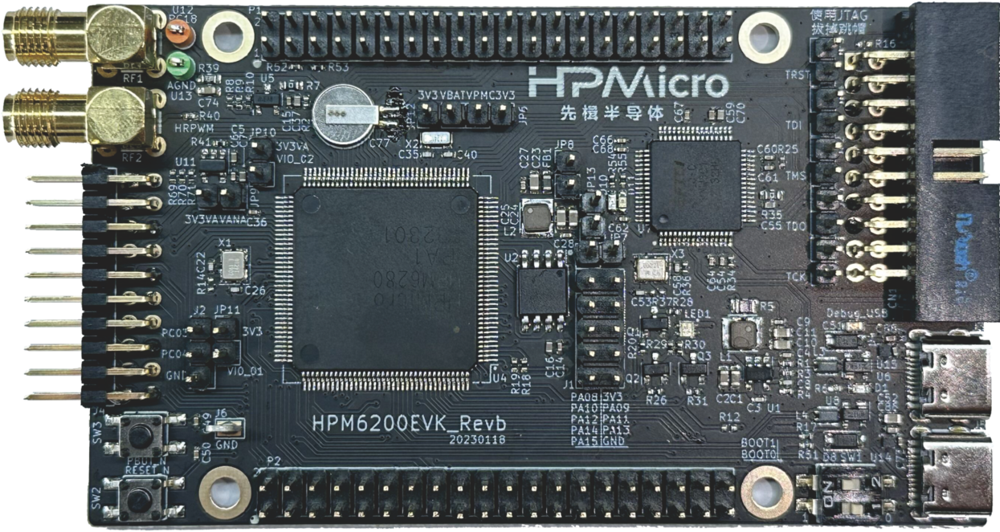

# HPM6200EVK

## Overview
The HPM6200EVK provides a series of interfaces for the characteristic peripherals of the HPM6200 series microcontrollers, including an ADC input SMA interface, a high-resolution PWM output SMA interface, and a first-class motor control interface. HPM6200EVK also integrates two 2x20 pin IO expansion interfaces, which connect most of the IOs of HPM6200 MCU for users to freely evaluate. HPM6200EVK expands NOR Flash storage for MCU and integrates an on-board debugger.

## DIP Switch SW1

- Bit 1 and 2 controls boot mode

| bit[2:1] | Description                  |
| -------- | ---------------------------- |
| OFF, OFF | Boot from Quad SPI NOR flash |
| OFF, ON  | Serial boot                  |
| ON, OFF  | ISP                          |

## Button

(lab_hpm6200evk_board_buttons)=

| Name       | FUNCTIONS                                      |
| ---------- | ---------------------------------------------- |
| PBUTN (SW3) | Power Button, TinyUF2 Boot Button, GPIO Button |
| RESET (SW2) | Reset Button                                   |

## Pin Description

(lab_hpm6200_evk_board)=

- UART pin

 The UART2 is used for core1 debug console or some functional testing using UART, such as MICROROS_UART, USB_CDC_ACM_UART, MODBUS_RTU etc.

| Function   | Position | Remark   |
| ---------- | -------- | ------   |
| UART2.TXD | P1[8]   |
| UART2.RXD | P1[10]   |
| UART2.break | P2[29] | generate uart break signal |

- LIN Pin:

| Function | Position |
| ---------- | -------- |
| LIN0.TX    | J1[3] |
| LIN0.RX    | J1[6] |

- SDM Pin:

| Function | Position |
| ---------- | -------- |
| SDM0.CLK_3    | P2[27] |
| SDM0.DAT_3    | P2[28] |

- SPI Pin：

| Function | Position |
| --------- | ------ |
| SPI1.CSN  | P2[29] |
| SPI1.SCLK | P2[32] |
| SPI1.MISO | P2[31] |
| SPI1.MOSI | P2[33] |

- I2C Pin：

| Function | Position |
| -------- | ------ |
| I2C0.SCL | P2[7] |
| I2C0.SDA | P2[10] |

- ACMP Pin:

| Function | Position |
| ---------- | ------ |
| ACMP.CMP1.INN5 | J4[6] |
| ACMP.COMP_1 | J4[8]  |

- GPTMR Pin:

| Function | Position | Remark   |
| ------------- | ------ | ------ |
| GPTMR1.CAPT_0 | P2[3] |
| GPTMR1.COMP_0 | P2[23] | MCLK of i2s emulation |
| GPTMR1.COMP_1 | P2[24]  | LRCK of i2s emulation |
| GPTMR1.COMP_2 | P2[5]  | BLCK of i2s emulation |

- ADC16 Pin:

| Function  | Position |
| --------- | -------- |
| ADC0.INA8 | P2[11]   |

- DAC Pin:

| Function | Position |
| -------- | -------- |
| DAC0.OUT | J2[1]    |
| DAC1.OUT | J2[2]    |

- PWM Pin:

| Function | Position |
| -------- | ----- |
| PWM0.P0 | J4[14] |
| PWM0.P1 | J4[13] |

- HRPWM Pin:

| Function     | Position  |
| -------- | ----- |
| HRPWM0.P0 | RF2 |
| HRPWM0.P2 | P2[29] |

- PLA Output Pin:

| Function     | Position  |
| -------- | ----- |
| PLA.OUT | P1[26] |

- Motor Pin:

  Refer to section [DRV-LV50A-MP1907 Motor Driver Board ](lab_drv_lv50a_mp1907) for configuration

  The HALL pin of the hpm6200evk needs to be connected.

  - HALL Pin：

  | Function      | evk Position    | Motor Position |
  | --------- | ------      | ------      |
  | HALL.U    | J4[20]      | J22[3]      |
  | HALL.V    | J4[18]      | J22[4]      |
  | HALL.W    | J4[16]      | J22[5]      |
  | GND       | J4[4]       | J22[1]      |

- Tamper Pin

| Function | Pin    | Position |  Mode  |
|----------|--------|--------|----------|
| TAMP.04  | PZ04   | P1[33] | Active Mode |
| TAMP.05  | PZ05   | P1[36] | Active Mode |
| TAMP.06  | PZ06   | P1[38] | Passive Mode |

- CS Pin of i2s emulation

| Function | Position   |  Remark |
| -------- | ---------  | ------ |
| PB31     | P1[7]      | the pin that controls the SPI slave CS |
