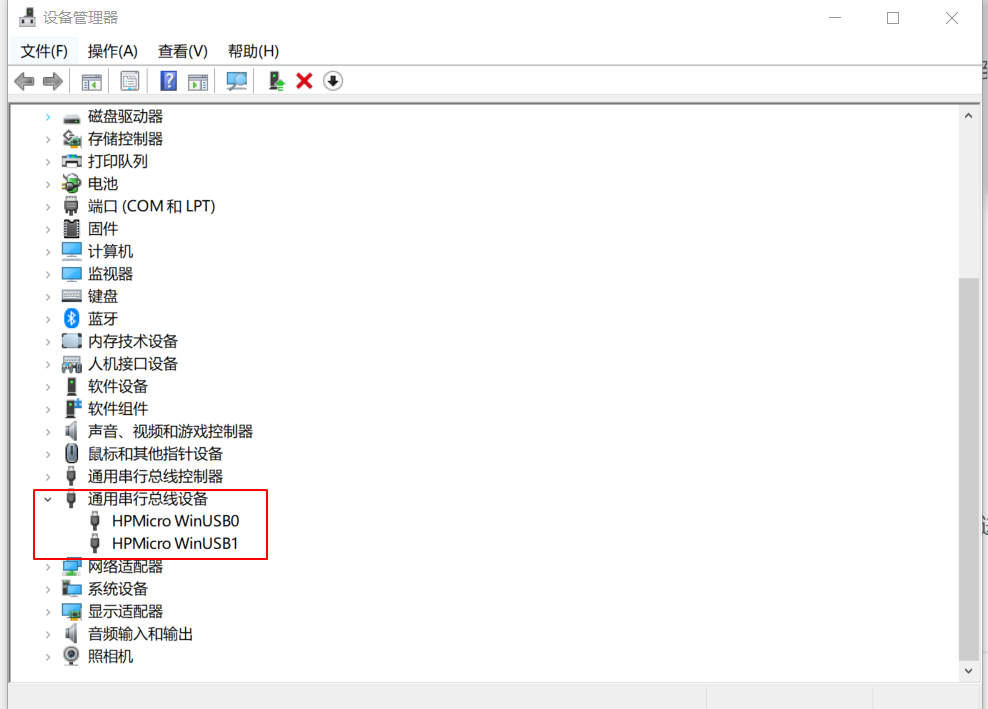
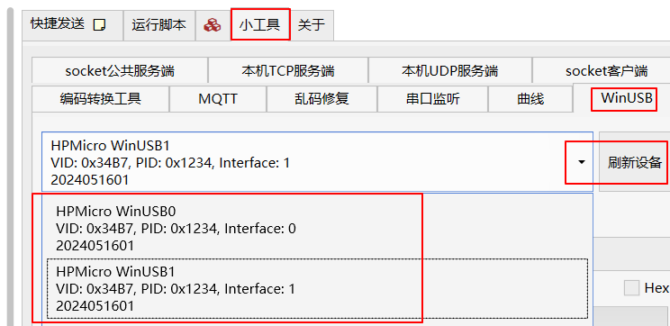
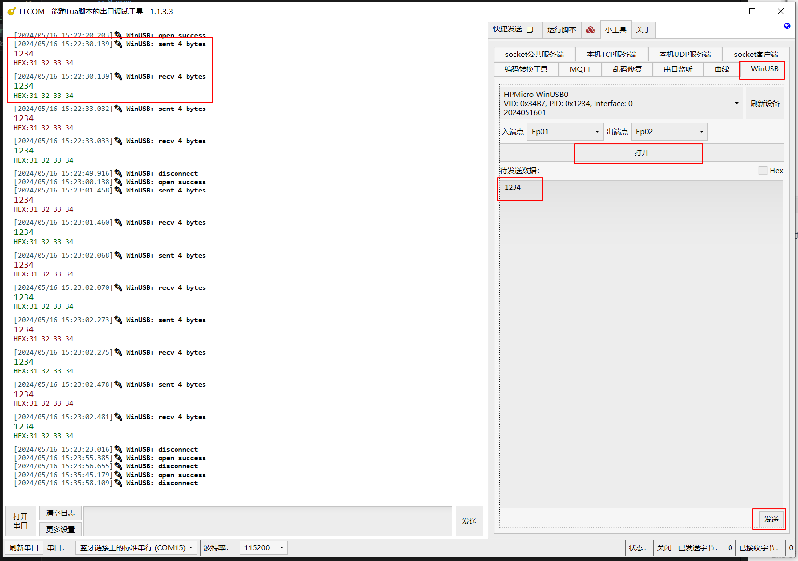

# WinUSB 2.0

## Overview

This example project shows WinUSB 2.0 device.

In this example, the USB device has 2 interfaces, each with 1 IN Endpoint and 1 OUT Endpoint. The USB device through OUT Endpoint to receive data from PC, then will send the data back to the PC through IN Endpoint.

## Board Setting

- Connect a USB port on PC to the PWR DEBUG port on the development board with a USB Type-C cable
- Connect a USB port on PC to one of USB port on the development board with a USB Type-C cable

## Running the example

- Download the program to the development board to run, the computer can automatically recognize and install drivers, and the device manager can view two universal serial bus devices.
    

- Through the LLCOM debugging tool, in the "WinUSB" menu, two USB interfaces can be seen by pulling down.
    

- Select "HPMicro WinUSB0" or "HPMicro WinUSB1", click the "Open" button, and then enter the send data. The left window will display the sent and received data.
    

## Note

- You can make the USB device have one interface by set the macro `DOUBLE_WINUSB=0` in CMakelists.txt.

- When Windows does not recognize the device, the reason may be that the device's VID, PID, and device version number have already been registered in the Windows registry and do not support WCID. The solution is to delete the relevant entries in the registry or use a different VID, PID, or device version number.