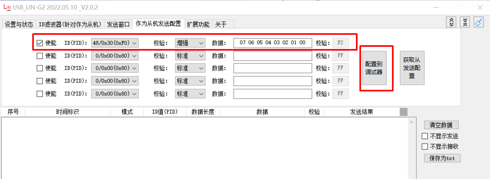
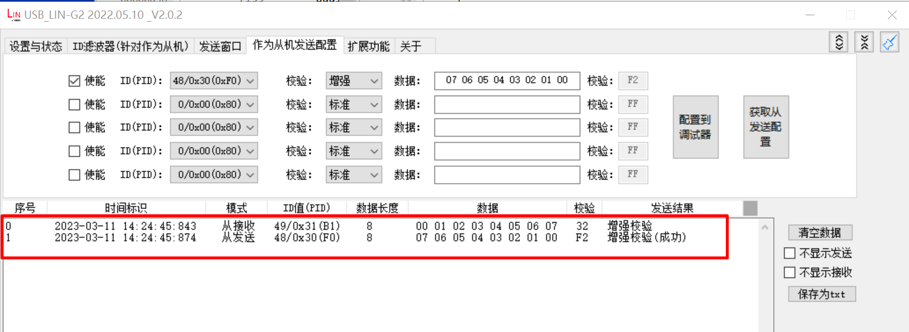

# uart_lin_master
## Overview

This project demonstrates the functionality of UART simulation LIN master.

## Note

The interval between LIN frames should be greater than or equal to the transmission time of 4 UART bytes。

## Board Setting

- On development boards without onboard LIN transceivers:
  Need a LIN transceiver and a USB_LIN debugger
  Connect the UART TX/RX pins on the development board to the TX/RX signal of the LIN transceiver, and connect the USB_LIN debugger to the LIN signal of the LIN transceiver.
- On development boards with onboard LIN transceivers:
  Need a USB_LIN debugger
  Connect the LIN signal and GND of the debugger to the corresponding pins on the development board.

Please refer to [Pin Description](lab_board_resource) for specific board.

## Running the example

Configure usb_lin debugger:
- Configure com and baudrate, then click `Set to Debugger` option
  
- Set ID, data and checksum mode, tick `enable option`， then click `Configure to Debugger` option：
  
- Running the example, check the result in debugger window
  

When the example runs successfully, the log would be seen on the terminal like:
```console
Test uart lin master polling transfer
uart lin master send ID: 0x31
uart send 8 data:
0x0 0x1 0x2 0x3 0x4 0x5 0x6 0x7
uart lin master send ID: 0x30
uart receive 8 data:
0x7 0x6 0x5 0x4 0x3 0x2 0x1 0x0

Test uart lin master interrupt transfer
uart lin master send ID: 0x31
uart send 8 data:
0x0 0x1 0x2 0x3 0x4 0x5 0x6 0x7
uart lin master send ID: 0x30
uart receive 8 data:
0x7 0x6 0x5 0x4 0x3 0x2 0x1 0x0
```
