# ECAT_IO

## 1. Overview

The ECAT_IO example demonstrates the steps to implement an ECAT digital IO slave station with the slave stack code (SSC).
- Input IO(2bit): SW6
- Output IO(2bit): LED8/LED3
- RUN LED: LED7
- ERR LED: LED6

## 2. Prepare

### 2.1 Hardware
  - HPM6E00EVK(RevA)
  - PC with Ethernet port
      - TWinCAT3 software has compatibility issues with PC network cards. [some supported Intel network cards](https://infosys.beckhoff.com/english.php?content=../content/1033/tc3_overview/9309844363.html&id=1489698440745036069)
### 2.2 Software
  - TwinCAT3.1(Build 4024.56)
  - SSC Tool(SSC Version: 5.13; Config File Vers: 1.5.3.0)
  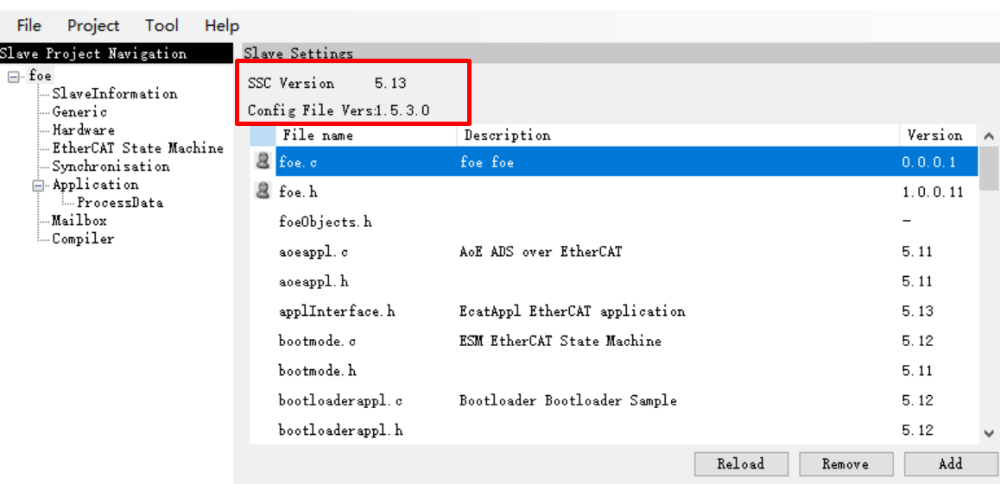

## 3. Project Setting

### 3.1 EEPROM Emulation Setting
  - The default setting is to use Flash to simulate EEPROM
### 3.2 Using actual EEPROM
  - set the "ESC_EEPROM_EMULATION" and "CREATE_EEPROM_CONTENT" under the "Hardware" attribute to 0 in SSC Tool, then generate the slave protocol stack code.
  - Modify `CMakeLists.txt` context to "set(CONFIG_EEPROM_EMULATION 0)".

## 4. Generate EtherCAT slave stack code

Due to licensing issues, HPMSDK does not provide EtherCAT slave protocol stack code (SSC). Users have download the SSC Tool from Beckoff's official website and generate the slave stack code according to the steps.

### 4.1. Download SSC Tool
  1. Enter[ETG Download website](https://www.ethercat.org/en/downloads.html), input "SSC" to fliter resource.
    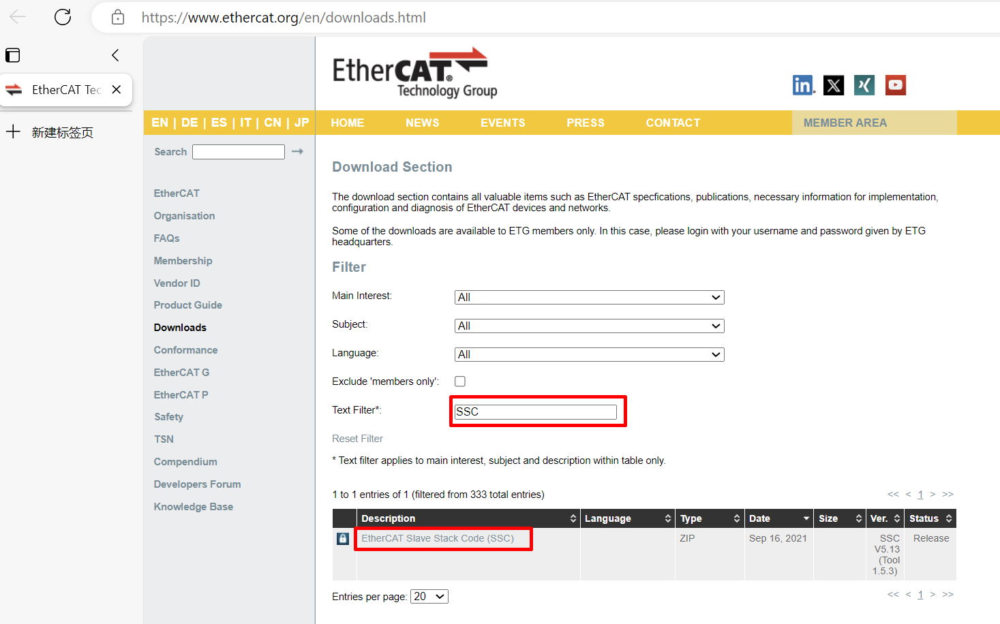
    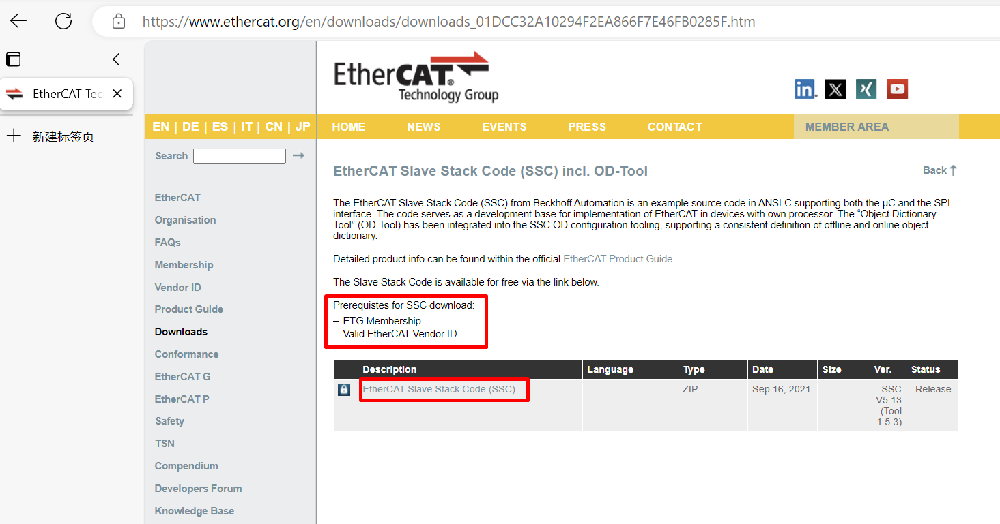

      <u>**To download, you need to provide an ETG member account and a valid vendor ID**</u>

  2. Download and install SSC Tool

### 4.2 SSC Tool import configuration files
  1. Open SSC Tool, click **Tool->Options**
    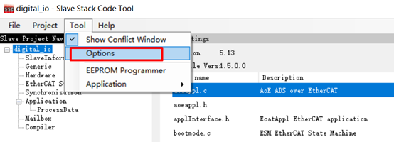
  2. click Configurations, import configuration file(<hpm_sdk>/samples/ethercat/ecat_io/SSC/Config/HPM_ECAT_IO_Config.xml)
    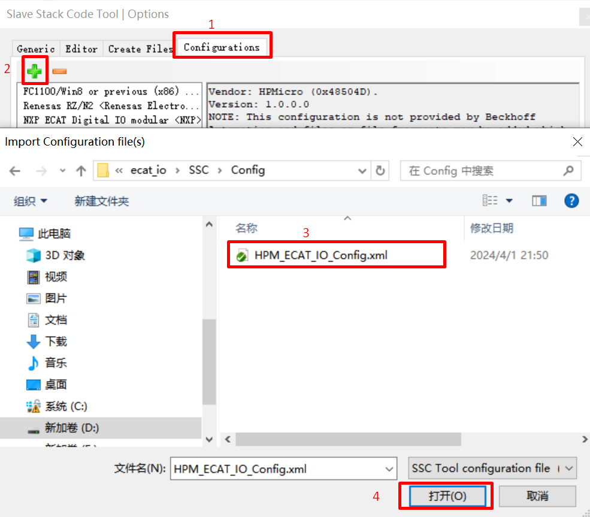
### 4.3 SSC Tool create new project
  1. click **File->New**
    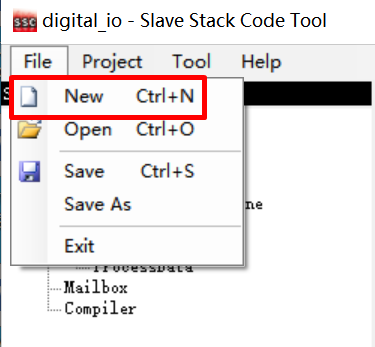
  2. Click **Custom** option, and select **HPMicro ECAT Digital IO <HPMicro>** from the drop-down list
    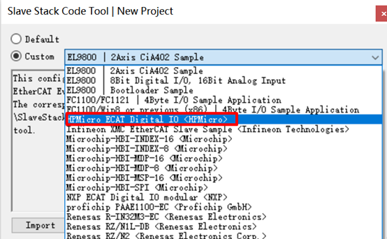
  3. Save project, specify the file path
    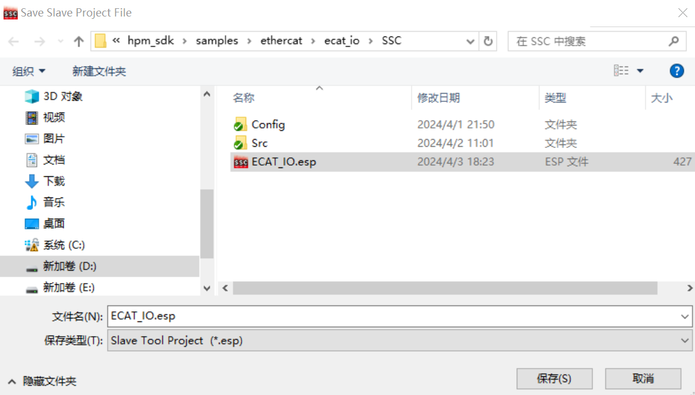
  4. import application
    - Click **Tool->Application->Import**, Import <hpm_sdk>/samples/ethercat/ecat_io/SSC/digital_io.xlsx
    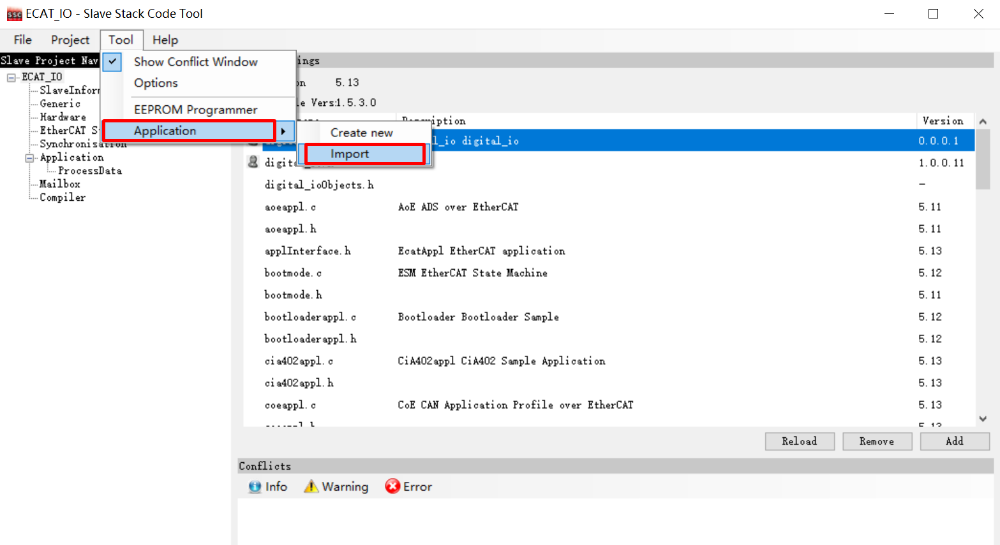
    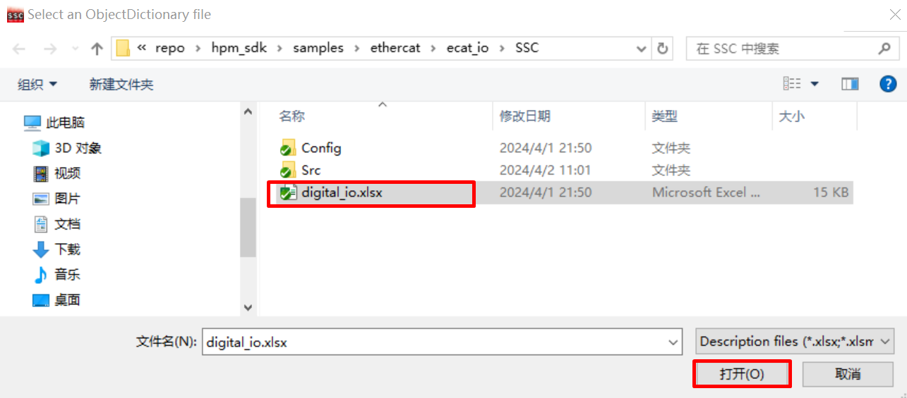
    - Click **OK**
    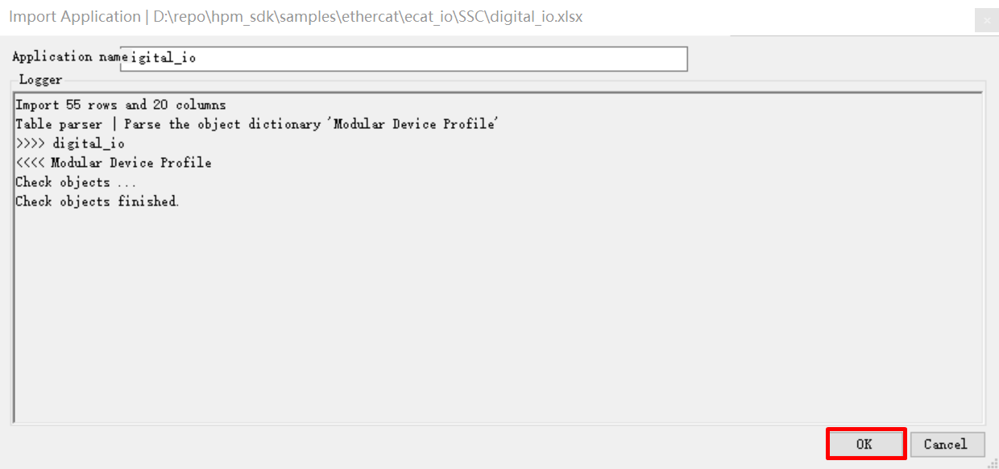
### 4.4 Create slave stack files
  1. Click **Project->Create new Slave Files**
    
  2. Specify the output path, the output source folder have to set to <ecat_io sample path>/SSC/Src, if other path, have to copy generated SRC folder to <ecat_io sample path>/SSC/Src
    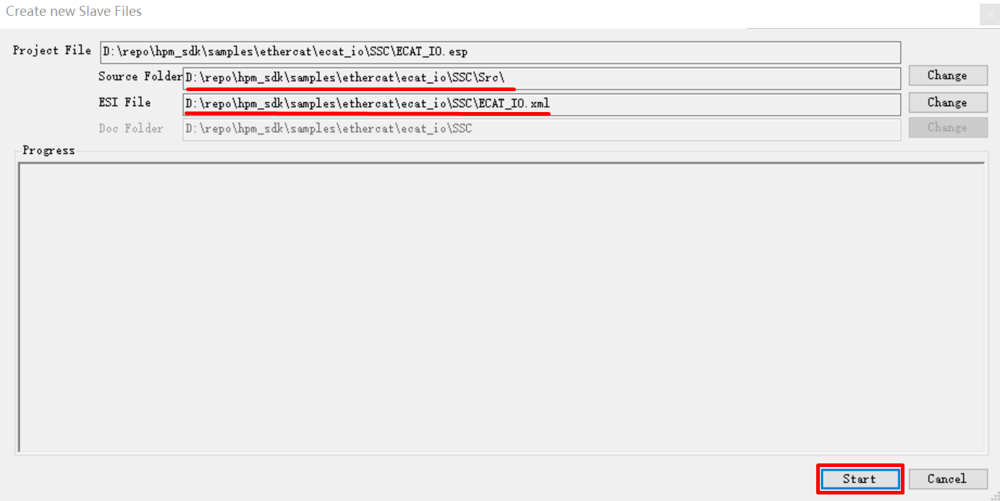

## 5. TwinCAT Project setting

### 5.1. Add ESI file
  Copy the generated (**ECAT-IO.xml**) by SSC tool in previous steps to TwinCAT(**C:\TwinCAT\3.1\Config\Io\EtherCAT**).

### 5.2 Create Project
  1. Open TwinCAT，click **File->New->Project**
    
  2. Click **TwinCAT Project**, after naming, click **OK**
    

### 5.3 Software Configuration
  1. Update network card driver (required for first use)
    
    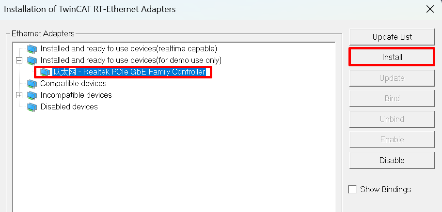
  2. clock setting
    The TwinCAT may report the following error during runtime, win8settick.bat needs to run with administrator privileges(C：\TwinCAT\3.1\System\win8settick.bat)
      - - -
      *Init4\RTime：Start Interrupt：Ticker started >> AdsWarning4115 （0x1013,RTIME：system clock setup failed）*
      - - -
      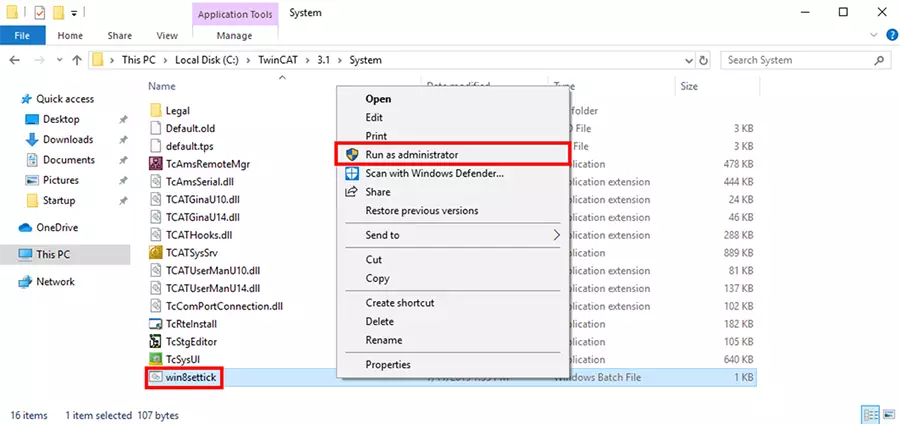

### 5.4 Scan device
  1. Right click Device, then click Scan
    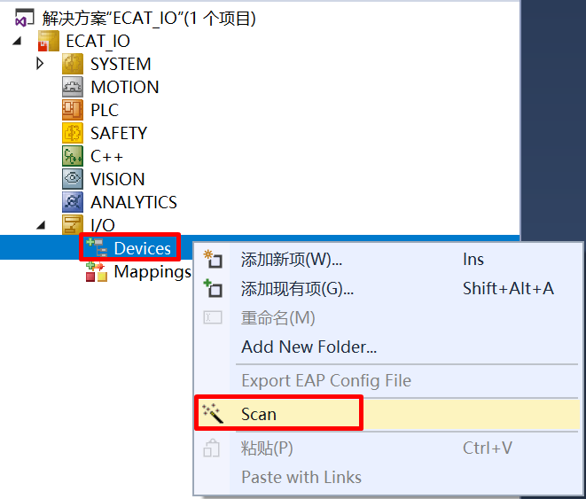
  2. Choose correct network
    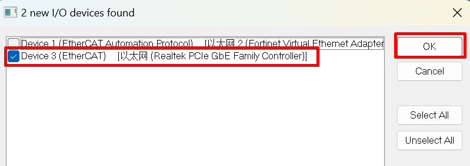

### 5.5 Update EEPROM context
  1. Double click on the scanned device, click **Online**, right click**Box**, then click **EEPROM Update**。

      ***For cases where the EEPROM content is empty, it is not possible to find a matching Box when scanning the device. In this case, it is necessary to update the EEPROM content。***

      ***In the case where EEPROM content is empty, When ESC is powered on to load EEPROM data, a checksum error will occur, which will cause PDI to not work. At this time, EtherCAT communication is possible and EEPROM content can be updated through the main station.***

      
  2. chosse correct files, click **OK**, wait for completion
      

  3. Reset the board, delete the scanned devices and rescanning
      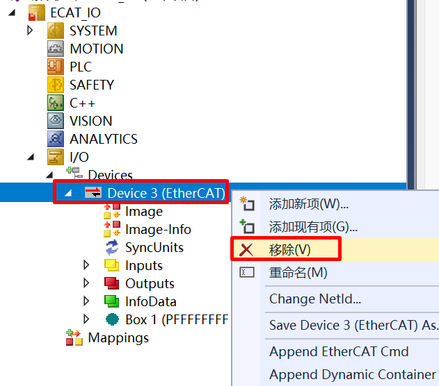
      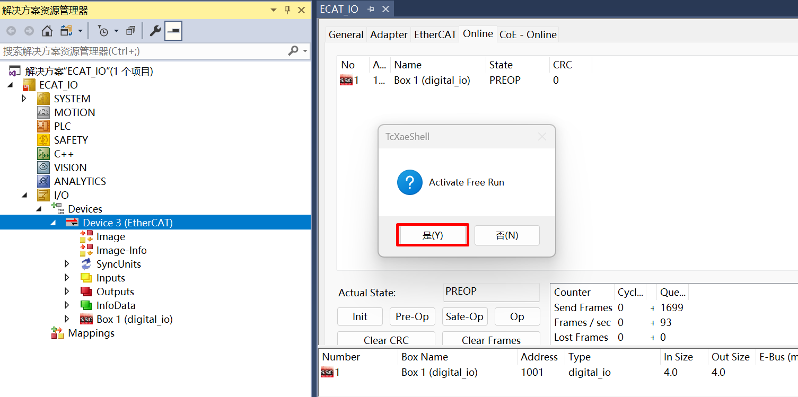

### 5.6 IO Control
  1. Input IO, change DIP switch, "InputCounter" value change in TwinCAT
    
  2. Output IO, write "OutputCounter" value in Twincat, Output LED change
    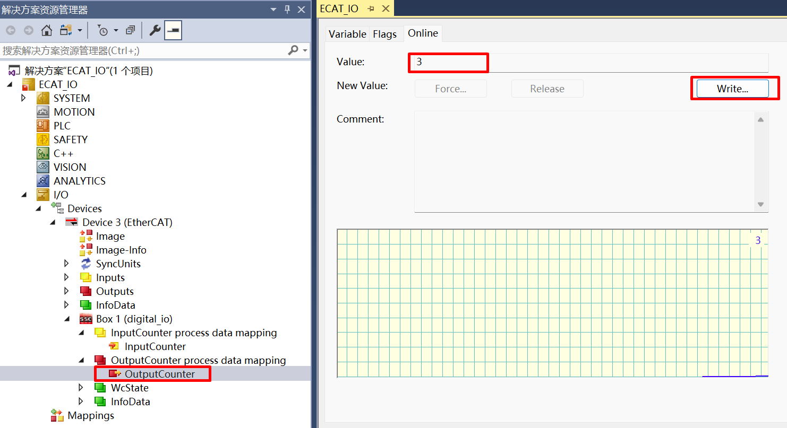
  3. Check RUN LED and ERR_LED status

### 5.7 DC setting
  1. double clcik "Box", click "DC", click "Advanced Settings"
      
  2. Set mode  to "DC-Synchron", set Shift Time(Usually 20% to 30% of Sync Unit Cycle time)
      
  3. double click "Device", click "EtherCAT", click "Advanced Settings"
      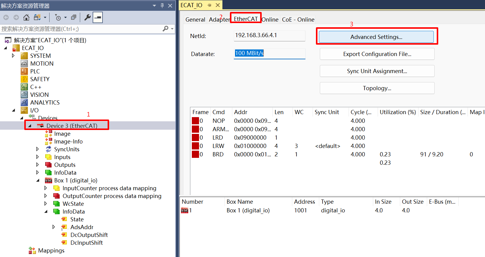
  4. click "Distributed Clock", choose "DC in use", click "OK"
      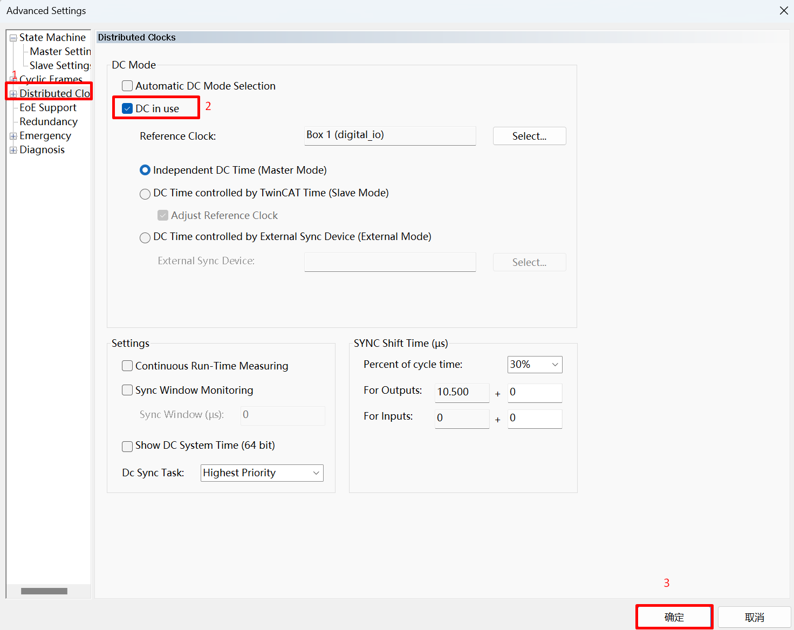
  5. Restart TwinCAT
      


## 6. Running the example

After the project is running correctly, the serial terminal will output the following information, and the input-output IO status corresponds to the TwinCAT project configuration:
```console
EtherCAT IO sample
EEPROM loading with checksum error.
EtherCAT communication is possible even if the EEPROM is blank(checksum error),
but PDI not operational, please update eeprom  context.
```
or
```console
EtherCAT IO sample
EEPROM loading successful, no checksum error.
```


